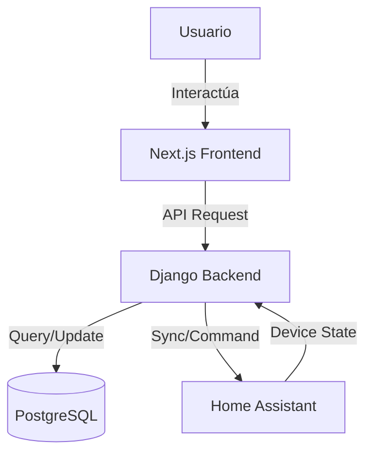

# Documentación del Proyecto Nezu HomePilot

## 1. Visión General

**Nezu HomePilot** es una solución integral de domótica diseñada para centralizar el control de dispositivos inteligentes. Actúa como un puente entre Home Assistant y una interfaz de usuario moderna y personalizada, permitiendo a los usuarios gestionar dispositivos, habitaciones, rutinas y escenas desde un dashboard intuitivo.

### Funcionalidades Clave
- **Dashboard Personalizable:** Grid interactivo con widgets redimensionables.
- **Gestión de Dispositivos:** Control de encendido/apagado, edición de nombres y asignación a habitaciones.
- **Navegación Intuitiva:** Organización por habitaciones y categorías.
- **Automatización:** Ejecución de rutinas y escenas predefinidas.
- **Sincronización Bidireccional:** Integración en tiempo real con Home Assistant.
- **Multiusuario:** Autenticación segura y perfiles de usuario.

---

## 2. Arquitectura Técnica

El proyecto sigue una arquitectura **Monorepo** que alberga tanto el backend como el frontend, facilitando la gestión del código y el despliegue.

### Stack Tecnológico

| Componente | Tecnología | Descripción |
|------------|------------|-------------|
| **Frontend** | Next.js 15 (React) | Framework moderno con App Router y Server Components. |
| **Estilos** | Tailwind CSS | Sistema de diseño utilitario para UI rápida y responsiva. |
| **Backend** | Python / Django | API REST robusta y segura. |
| **Base de Datos** | PostgreSQL (Neon) | Almacenamiento relacional escalable en la nube. |
| **Integración** | Home Assistant API | Comunicación con el ecosistema IoT local. |
| **Despliegue** | Vercel & Render | Frontend en Vercel, Backend en Render. |

### Diagrama de Flujo de Datos


---

## 3. Backend (Django)

El backend expone una API RESTful para que el frontend consuma datos y ejecute comandos. Se encuentra en el directorio `/backend`.

### Estructura de Aplicaciones
- **`core`**: Configuración base, servicios comunes y gestión de usuarios.
- **`devices`**: Lógica de dispositivos.
  - `Device`: Modelo principal que representa un dispositivo IoT.
  - Sincronización con Home Assistant.
- **`rooms`**: Gestión de espacios físicos.
  - `Room`: Agrupación lógica de dispositivos.
  - `Zone`: Agrupación de habitaciones (ej. "Planta Baja").
- **`routines`**: Automatizaciones y escenas.
  - `NezuRoutine`: Rutinas personalizadas del sistema.
  - `Scene`: Escenas importadas de Home Assistant.

### Servicios Clave
- **`HomeAssistantClient`**: Cliente HTTP para comunicarse con la API de Home Assistant.
- **`DeviceSyncService`**: Servicio encargado de mantener la base de datos local sincronizada con el estado real de los dispositivos en HA.

### Configuración
El archivo `settings.py` maneja la configuración del entorno, utilizando variables de entorno (`.env`) para secretos como credenciales de base de datos y tokens de API.

---

## 4. Frontend (Next.js)

El frontend es una aplicación web progresiva (PWA) construida con Next.js y TypeScript. Se encuentra en el directorio `/src`.

### Estructura de Directorios
- **`src/app`**: Rutas de la aplicación (App Router).
  - `(app)`: Layout autenticado (Dashboard, Dispositivos, etc.).
  - `(auth)`: Layout de autenticación (Login, Registro).
- **`src/modules`**: Arquitectura modular por funcionalidad.
  - `dashboard`: Componentes del panel principal (`CustomizableGrid`, `WelcomeHeader`).
  - `devices`: Tarjetas de dispositivos y lógica de control.
  - `rooms`: Vistas de detalle de habitaciones y grids.
  - `core`: Componentes UI reutilizables (`Button`, `Card`, `Modal`).
- **`src/lib`**: Utilidades y configuraciones globales.

### Componentes UI Destacados
1.  **`DashboardLayout`**: Layout principal que maneja la navegación responsive (Sidebar en escritorio, Bottom Nav en móvil).
2.  **`CustomizableGrid`**: Sistema de grid responsivo (`react-grid-layout`) que adapta el número de columnas según el dispositivo.
3.  **`DeviceCard`**: Componente visual para controlar un dispositivo individual.
4.  **`RoomDetailsPage`**: Página de detalle con controles masivos ("All On/Off").

---

## 5. Despliegue e Infraestructura

### Frontend (Vercel)
- **Repositorio Conectado**: GitHub.
- **Configuración de Build**: `next build`.
- **Variables de Entorno**:
  - `NEXT_PUBLIC_API_URL`: URL del backend en Render.

### Backend (Render)
- **Servicio**: Web Service (Python 3.9).
- **Base de Datos**: Neon Tech (PostgreSQL).
- **Comando de Build**: `./build.sh` (instala dependencias y compila estáticos).
- **Comando de Inicio**: `gunicorn core.wsgi:application`.
- **Variables Críticas**:
  - `DATABASE_URL`: URI de conexión a Neon.
  - `HA_URL` & `HA_TOKEN`: Credenciales de Home Assistant.
  - `DJANGO_SECRET_KEY`: Llave de seguridad.

---

## 6. Guía de Instalación Local

Siga estos pasos para levantar el entorno de desarrollo.

### Prerrequisitos
- Node.js 18+
- Python 3.9+
- PostgreSQL (opcional, puede usar SQLite localmente)

### 1. Configurar Backend
```bash
cd backend
python -m venv venv
# Windows
.\venv\Scripts\activate
# Mac/Linux
source venv/bin/activate

pip install -r requirements.txt
cp .env.example .env
# Configurar variables en .env
python manage.py migrate
python manage.py runserver
```

### 2. Configurar Frontend
```bash
# En la raíz del proyecto
npm install
cp .env.local.example .env.local
# Configurar NEXT_PUBLIC_API_URL=http://localhost:8000/api
npm run dev
```

### 3. Verificar
Acceda a `http://localhost:3000`. Si todo es correcto, debería ver la pantalla de Login y poder autenticarse contra el backend local.
